# simple-invoice-extractor

A simple demonstration of AI-powered Vietnamese invoice data extraction using OpenAI's GPT-4 Vision API.

> **Note**: This repository was created for an AI hackathon competition and developed within a few hours. There may be some mistakes or areas for improvement. Given more time, the implementation could be refined further.

## Table of Contents

- [1. Purpose](#1-purpose)
- [2. Features](#2-features)
- [3. Quick Start](#3-quick-start)
- [4. Usage](#4-usage)
- [5. Architecture](#5-architecture)
- [6. Extraction Flow](#6-extraction-flow)
- [7. Configuration](#7-configuration)
- [8. Data Structure](#8-data-structure)
- [9. Customization](#9-customization)
- [10. Integration with Peakflo System](#10-integration-with-peakflo-system)
- [11. Alternative Solution: Google Document AI](#11-alternative-solution-google-document-ai)

## 1. Purpose

This project demonstrates how to:
- Extract structured data from Vietnamese invoices (VAT/GTGT)
- Process both image and PDF formats
- Use GPT-4 Vision API for optical character recognition
- Handle Vietnamese text encoding properly
- Structure and export extracted data

## 2. Features

- **Multi-format Support**: PDF, PNG, JPG, JPEG
- **AI-Powered Extraction**: GPT-4 Vision API
- **Vietnamese Text Processing**: Proper encoding and recognition
- **Structured Output**: JSON and CSV export
- **Educational Focus**: Clean, documented code

## 3. Quick Start

### 1. Clone and Setup
```bash
git clone https://github.com/hieunv-ct/simple-invoice-extractor.git
cd simple-invoice-extractor
pip install -r requirements.txt
```

### 2. Configurate API Key
```bash
cp .env.example .env
# Edit .env and add your OpenAI API key
```

### 3. Run the Application
```bash
streamlit run app.py
```

## 4. Usage
- Upload Invoice: Choose a Vietnamese invoice file (PDF or image)
- Extract Data: Click "Extract Data with AI" button
- Review Results: View structured data in the interface
- Export: Download extracted data as JSON or CSV

## 5. Architecture
```
app.py                 # Streamlit interface
├── InvoiceProcessor   # Core extraction logic
├── AI Prompts         # Vietnamese-specific prompts
├── Utils              # Display and export functions
└── Examples           # Sample invoices and outputs
```

## 6. Extraction Flow

```mermaid
graph TD
    A[📄 Upload Invoice] --> B{📋 File Type Check}
    B -->|Image| D[🖼️ Image Processing]
    D --> E[📐 Image Resize & Optimization]
    E --> F[🔤 Base64 Encoding]
    F --> G[🤖 GPT-4 Vision API Call]
    G --> H[📝 Vietnamese Prompt Processing]
    H --> I[🧠 AI Text Recognition & Understanding]
    I --> J[📊 Structured JSON Extraction]
    J --> K{✅ Data Validation}
    K -->|Valid| L[💾 Display Results]
    K -->|Invalid| M[⚠️ Error Handling]
    M --> N[🔄 Retry or Manual Review]
    L --> O[📥 Export Options]
    O --> P[📄 JSON Download]
    O --> Q[📊 CSV Download]
    
    style A fill:#e1f5fe
    style G fill:#fff3e0
    style J fill:#e8f5e8
    style L fill:#f3e5f5
```



## 7. Configuration
Required Environment Variables
- OPENAI_API_KEY: Your OpenAI API key

Optional Configuration
- OPENAI_API_BASE_URL: Custom OpenAI endpoint

## 8. Data Structure
The extractor returns structured JSON with:
```json
{
  "company_info": {
    "seller_name": "...",
    "seller_tax_code": "...",
    "buyer_name": "..."
  },
  "invoice_details": {
    "invoice_number": "...",
    "invoice_date": "...",
    "serial": "..."
  },
  "financial_info": {
    "total_amount_before_tax": 0,
    "vat_rate": 10,
    "total_amount_after_tax": 0
  },
  "items": [...]
}
```

## 9. Customization

### Modifying Extraction Fields
Edit src/prompts.py to change the JSON structure:

```python
VIETNAMESE_INVOICE_PROCESSOR_PROMPT = """
        Extract these fields:
        {
        "custom_field": "...",
        ...
        }
    """
```

## 10. Integration with Peakflo System
When submitting bills to the Peakflo system, input customization is required:
- **Combine params**: example: `bill_number`: `serial_number` + '.' + `no` (e.g., "C22TDN.0000123")
- **Additional Required Data**: Many fields beyond invoice extraction are needed:
  - Purchase Order (PO) information
  - User login details (who creates the bill)
  - Vendor/supplier master data
  - Cost center and approval workflows
  - Payment terms and conditions
- **Field Mapping**: All mapping rules and field requirements should be provided by the relevant department
- **Data Validation**: Ensure extracted data meets Peakflo's specific formatting requirements

### Complete Workflow Implementation
During the Hackathon competition, a complete n8n workflow was built that:
1. **Receives extracted data** from this invoice processor
2. **Validates data** against business rules and required fields
3. **Combines data** with additional information (PO, user context, etc.)
4. **Prepares payload** for Peakflo Bill Creation API
5. **Handles API calls** and error management

> **Note**: This repository focuses specifically on the **data extraction from images** aspect. The complete workflow including validation, data combination, and API integration steps are not included here to keep the scope focused on the AI extraction capabilities.

## 11. Alternative Solution: Google Document AI
An alternative approach is to use Google Document AI, which has been tested and shows good performance for Vietnamese invoice extraction. This could be considered as a backup or primary solution depending on requirements.

